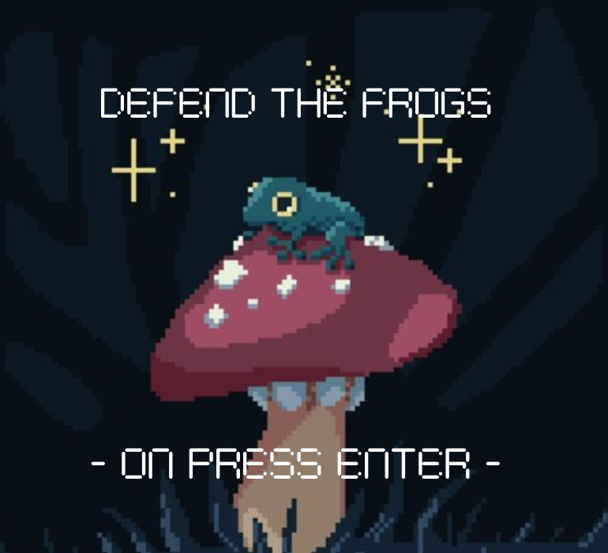

# DEFEND THE FROGS

## Equipo de desarrollo

- Martín Santiago Pena
- Gianluca Petri
- Francisco Barroso
- Nicolas Togninelli
- Federico Encinaz Sayago

## Capturas

## Reglas de Juego / Instrucciones

En este juego, asumes el papel de Fred, una seta valiente que debe salvar a sus cuatro amigas ranas de los malvados slimes azules. Tu misión es eliminar a los slimes y proteger a tus ranas amigas, ya que si un slime llega a estar sobre una rana, su barra de vida disminuirá en un corazón y medio. Pero no te preocupes, Fred tiene la capacidad de curar a sus amigas.

Movimiento de Fred:
- W: Hace que Fred suba una casilla desde su posición actual.
- S: Hace que Fred baje una casilla desde su posición actual.
- D: Hace que Fred se desplace hacia la derecha desde su posición actual.
- A: Hace que Fred se desplace hacia la izquierda desde su posición actual.

## Otros

- K2002/UTN-FRBA
- Versión de wollok: 3.0.0
- Una vez terminado, no tenemos problemas en que el repositorio sea público / queremos manternerlo privado
